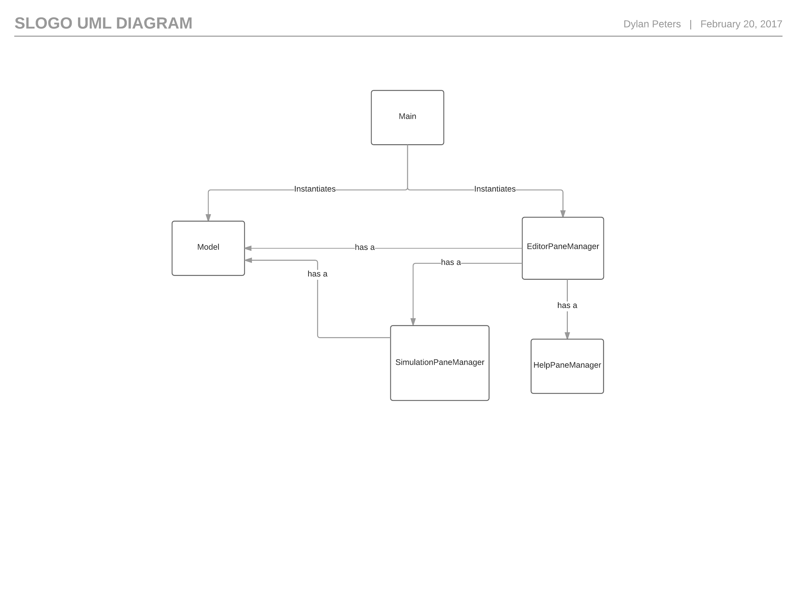
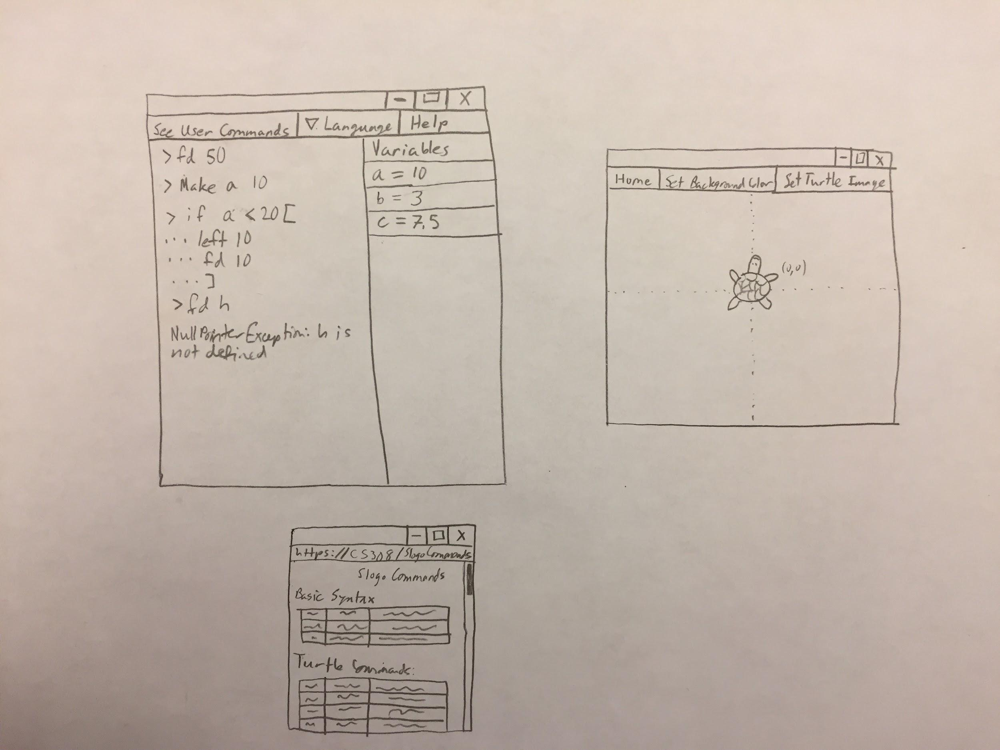

Authors:

Dylan Peters

Andreas Santos

Tavo Loaiza

Yilin Gao

Slogo DESIGN

**Introduction:**

This purpose of this program is to create an IDE in which users can manipulate a "turtle" object with commands defined in the “Slogo language.” The turtle holds a pen, and by directing the movement of the turtle, the user can programmatically draw a picture. The primary goal in designing the project is to make it as flexible as possible, while maintaining a closed architecture and extensible API. In order to do this, we have split the problem into two smaller problems: the User Interface (front end) and the Model (back end), and we created external APIs for each of the two parts to allow them to communicate. Doing this allows a high degree of flexibility in the implementation of each of the two parts; for example, if there is a change in the front end, and the design specifications require that we add the ability to open and run a file, the front end team can add that functionality to the User Interface, and still allow the back end to parse the commands in the same way. The front end’s external API and the back end’s external API are both closed for modification and open for extension. In other words, the methods and classes that we choose to make up the external APIs cannot be changed or removed, but we can add new methods and classes to add new functionality.

**Design Overview:**

We separate our program into 2 major parts, frontend and backend, connected by the public Model class. The front end works on displaying graphic user interfaces and interacting with the user. The back end works on taking user inputs from the front end, computing actions based on user inputs, and sending actions to the front end. Below is a UML Diagram describing the relationships between the public classes (the classes that make up the front and back end external APIs)

**Figure: UML Diagram of Public Classes**

Front End: 

The front end is divided into three major parts, based on what the user will see and interact with. Those parts are: 

1. A display window with a terminal-style text display that allows the user to type in commands, change settings, and view the variables 

2. A window displaying the turtle, its environment, and its drawing. This window will be manipulated when the user types commands into the terminal.

3. Additional windows that the user can view by clicking the "help" button. These windows will display commands, variables, and instructions on how to use the program.

Each of these parts constitutes its own package, and within each package there is one public class that is called to create the window, along with several default-visibility classes that are used by the public class but cannot be viewed by classes outside the package. Therefore, there are 3 public classes that can interact with each other (and the back end) in order to execute the functionality of the program.

There are two front-end APIs: an External API and an Internal API. 

The external API consists of the three public classes: EditorPaneManager, SimulationPaneManager, and HelpPaneManager. The EditorPaneManager shows the termal-style display that the user interacts with to type commands. The SimulationPaneManager contains the display of the turtle and its drawing, as well as options to change background color, turtle image, etc. The HelpPaneManager is used to display commands, syntax, and other pertinent information to the user. Each of these classes will have public constructors, methods to change their height, width, and display language, and finally a method to get the Node that is used to represent their display. They are designed to be as simple to use as possible, while still allowing the client code to change a few basic properties.

The internal API consists of all of the package-level classes that are used by the public classes. These are split up between the subpackages that contain the EditorPaneManager, SimulationPaneManager, and HelpPaneManager. The SimulationPaneManager accesses an internal API containing a class to handle the display of the terminal (TerminalDisplayManager), a class to display the variables (VariableDisplayManager), and a class to display the menu bar (MenuBarDisplayManager). The EditorPaneManager uses these classes to interact with the user, and it passes the user’s input to the backend in order to calculate the state of the program. The SimulationPaneManager accesses classes to visualize the Turtle. These classes are ActorView and TurtleView. The ActorView is an abstract class that contains basic functionality of a sprite on the screen. The TurtleView extends this in order to implement the specific functionality of a turtle. This makes the code more modular and flexible, and allows us to add different types of sprites with slightly different behavior if we desire. Finally, the HelpPaneManager will access a HelpMenuBarManager and an HTMLViewManager in order to display a webpage to the user with helpful instructions.

Back End:

For back end, we intend to create one external API, but no internal API. The back end provides the following methods in the external API for the front end to send user input commands to it, and get state variables from it.

public Interface Model:

public void interpret (String command): the front end calls this method to send user inputs to the Model class. And the Interpreter instance in the Model class will interpret it, and generate a series of State variables to realize the command.

public boolean hasNext (): The front end calls this method to know if there are any more unimplemented State in the backend.

public State poll (): all State variables are stored as a queue in the back end. When new State variables are generated, the front end reads the next State variable and remove it from the queue with this API and implement it in the GUI.

public State peek (): The front end calls this API to get the next State variable without removing it from the back end.

**User Interface:**

The user interface is windowed in order to allow the user to arrange it in any convenient way. This design emulates Eclipse in that the visualization of the turtle opens in a new window, separate from the IDE’s window. Furthermore, this design allows the user to run multiple instances of the turtle simulation if we choose to implement this feature in the second sprint. Ultimately, using a windowed approach allows for the most flexibility in adding new features, and it improves the modularity of the code, as there is no overarching class that has to control several different displays. There are three main windows, as shown in this diagram of the user interface:

**Figure: Basic User Interface**

The Editor/Terminal Display: This window allows the user to input commands in order to control the turtle. It will contain a terminal-style text input view and a menu bar to change settings such as language. It will also contain a table that displays the variables currently in use.

The Turtle Simulation Display: This window shows the user a visualization of the commands he/she is inputting. It will have at least one turtle sprite that the user manipulates via the command line.

The Help Display: This is the simplest of the display windows. The help display will open up the CS308 website to the page that lists the Slogo commands ([http://www.cs.duke.edu/courses/compsci308/spring17/assign/03_slogo/commands.php](http://www.cs.duke.edu/courses/compsci308/spring17/assign/03_slogo/commands.php)) in a new window. It can also display other useful information to the user as well. Essentially, this class will be an HTML display for the website containing the commands.

**API Details:**

**Front End:**

**External API:**

'''java

	/**

	 * 

	 */

	package frontend.editor;

	import javafx.scene.Parent;

	/**

	 * This class will be of public visibility, so it will be visible to any class

	 * or interface in the program. Therefore, it will be part of the External API

	 * of the front end.

	 * 

	 * This class is designed to encapsulate the set up of the display of the

	 * editor/terminal functionality of the front end of the program. It creates a

	 * Parent object and populates it with a menu bar, a terminal-style text entry

	 * field, and a table with the values of the variables. That Parent object can

	 * then be accessed via the getParent() method, to be used as the root of a

	 * scene or to be added as a component in a larger display.

	 * 

	 * This class implements the EditorMenuBarDelegate and VariableDisplayDelegate

	 * interfaces to allow the EditorMenuBarManager and VariableDisplayManager to

	 * communicate with it when an event occurs.

	 * 

	 * This class can be extended in order to add more functionality, such as the

	 * ability to write a script and run it rather than simply use the

	 * Read-Eval-Print Loop, or to allow the user to undo or redo a command.

	 * 

	 * When this becomes a class it will implement EditorMenuBarDelegate,

	 * VariableDisplayDelegate, and TerminalDisplayDelegate, but to make the

	 * interface-representation of the class compile, it must "extend" the other

	 * interfaces.

	 * 

	 * @author Dylan Peters

	 *

	 */

	public interface EditorPaneManager extends EditorMenuBarDelegate,

			VariableDisplayDelegate, TerminalDisplayDelegate {

		// Constructors that will be present when this interface is turned into a

		// class:

		// public EditorPaneManager();

		// public EditorPaneManager(String language);

		// public EditorPaneManager(double width, double height);

		// public EditorPaneManager(double width, double height, String language);

		/**

		 * Sets the width of the Parent object that holds all of the UI components.

		 * 

		 * @param width

		 *            width of the Parent object that holds all of the UI

		 *            components.

		 */

		public void setWidth(double width);

		/**

		 * Gets the width of the Parent object that holds all of the UI components.

		 * 

		 * @return width of the Parent object that holds all of the UI components.

		 */

		public double getWidth();

		/**

		 * Sets the height of the Parent object that holds all of the UI components.

		 * 

		 * @param height

		 *            height of the Parent object that holds all of the UI

		 *            components.

		 */

		public void setHeight(double height);

		/**

		 * Gets the height of the Parent object that holds all of the UI components.

		 * 

		 * @return height of the Parent object that holds all of the UI components.

		 */

		public double getHeight();

		/**

		 * Sets the language that this class uses to display its contents. It will

		 * use a resource file with the words in that language to populate its

		 * contents.

		 * 

		 * @param language

		 *            a string representing the language to be displayed

		 */

		public void setLanguage(String language);

		/**

		 * Gets the language that this class uses to display its contents. This

		 * class will use a resource file with the words in that language to

		 * populate its contents.

		 * 

		 * @return a string representing the language to be displayed

		 */

		public String getLanguage();

		/**

		 * Gets the display object that this class is manipulating and setting up.

		 * The Parent returned by this method should be displayed to allow the user

		 * to interact with the editor. It can be used as the root of a Scene or

		 * added as a component in a larger display.

		 * 

		 * @return Parent containing all the UI components that allow the user to

		 *         interact with the Editor portion of the program

		 */

		public Parent getParent();

		// EditorMenuBarDelegate methods:

		/**

		 * This is the implementation of the method in the EditorMenuBarDelegate

		 * interface.

		 * 

		 * This method is called when the user selects to change the language in

		 * which the program is displayed. It changes the language for every UI item

		 * being displayed on the screen.

		 * 

		 * @param language

		 *            the language to display the program in

		 */

		void didSelectLanguage(String language);

		/**

		 * This is the implementation of the method in the EditorMenuBarDelegate

		 * interface.

		 * 

		 * This method is called when the user wants to see a list of the

		 * user-defined commands. This method displays all the commands the user has

		 * defined by printing them in the terminal portion of the display.

		 */

		void seeUserDefinedCommands();

		/**

		 * This is the implementation of the method in the EditorMenuBarDelegate

		 * interface.

		 * 

		 * This method is called when the user wants to see a help page. It displays

		 * a list of all possible commands, as well as basic protocol about how to

		 * use the program by printing it to the terminal portion of the display.

		 */

		void help();

		// VariableDisplayDelegate methods:

		/**

		 * This is the implementation of the method in the VariableDisplayDelegate

		 * interface.

		 * 

		 * This method is called when the user changes a variable via the

		 * VariableDisplayManager. It changes the value of the variable in the

		 * model, then updates the VariableDisplayManager to reflect the change.

		 */

		void didChangeVariable(String variable, Object value);

		// TerminalDisplayDelegate methods:

		/**

		 * This is the implementation of the method in the TerminalDisplayDelegate

		 * interface.

		 * 

		 * This method is called by the TerminalDisplayManager to indicate to the

		 * object implementing the interface that the user has entered a command

		 * into the terminal and hit enter, thus telling the program to execute the

		 * command. It implements the consequences of the command: parse the

		 * command, update the model's state based on the command, and then update

		 * the view so the user can see the command's effects.

		 * 

		 * @param command

		 *            the command the user has entered to be executed.

		 */

		void processCommand(String command);

	}

	**Internal API:**

	/**

	 * 

	 */

	package frontend.editor;

	/**

	 * This interface will be of default visibility, so it will only be visible to

	 * other members of its package. Therefore, it will be part of the internal API

	 * of the front end.

	 * 

	 * This interface (which is intended to be an interface in the implementation of

	 * the project as well) is designed to allow the EditorMenuBar to communicate

	 * with the EditorPaneManager class when the user interacts with a Control

	 * component in the EditorMenuBar.

	 * 

	 * The EditorMenuBarManager will have an object that implements this interface.

	 * (This object is referred to as the "delegate" because the

	 * EditorMenuBarManager "delegates" the implementation of these methods to the

	 * class that implements the interface.) When a button is clicked or a combobox

	 * is selected, the EditorMenuBarManager will call the method associated with

	 * that button/combobox, which tells the delegate to perform some action that it

	 * has implemented.

	 * 

	 * This pattern allows the EditorMenuBarManager to set up the UI aspects of the

	 * menu bar (buttons to allow the user to run the code, comboboxes to select

	 * language, etc.) without having to directly implement the effects of those

	 * Control objects being interacted with. Furthermore, it allows the class that

	 * implements this interface to be able to implement the behavior (changing the

	 * language, running the code, etc.) without having to deal with the boilerplate

	 * code and setup required to set up and display the menu bar. This makes the

	 * code more modular (easier to change the implementation of these methods) and

	 * more encapsulated (don't have to know how the buttons/comboboxes are

	 * displayed).

	 * 

	 * Additional methods can be written here when other buttons are added to the

	 * EditorMenuBarManager.

	 * 

	 * @author Dylan Peters

	 *

	 */

	interface EditorMenuBarDelegate {

		/**

		 * This method is called when the user selects to change the language in

		 * which the program is displayed. The class implementing this method should

		 * change the language for every UI item being displayed on the screen.

		 * 

		 * @param language

		 *            the language to display the program in

		 */

		void didSelectLanguage(String language);

		/**

		 * This method is called when the user wants to see a list of the

		 * user-defined commands. The class implementing this interface should

		 * somehow display all the commands the user has defined.

		 */

		void seeUserDefinedCommands();

		/**

		 * This method is called when the user wants to see a help page. The class

		 * implementing this method should display a list of all possible commands,

		 * as well as basic protocol about how to use the program.

		 */

		void help();

	}

	/**

	 * 

	 */

	package frontend.editor;

	import javafx.scene.Node;

	/**

	 * This class will be of default visibility, so it will only be visible to other

	 * members of its package. Therefore, it will be part of the internal API of the

	 * front end.

	 * 

	 * This class sets up and manages a menu bar to be used in the

	 * EditorPaneManager. The goal of this class is to hide the details of

	 * implementation required to display buttons and other Control objects required

	 * for the user to interact with in the editor. This class can hold an object

	 * that implements the EditorMenuBarDelegate interface. It will call the methods

	 * of that interface when Control components are changed by the user, to alert

	 * the rest of the program about the changes.

	 * 

	 * @author Dylan Peters

	 *

	 */

	interface EditorMenuBarManager {

		// Constructors that will be present when this interface is turned into a

		// class:

		// public EditorMenuBarManager();

		// public EditorMenuBarManager(String language);

		// public EditorMenuBarManager(EditorMenuBarDelegate delegate);

		// public EditorMenuBarManager(EditorMenuBarDelegate delegate, String

		// language);

		/**

		 * Sets the delegate of this instance to the object passed. The delegate's

		 * methods are called when the user interacts with one or more of the

		 * Control components in the EditorMenuBar.

		 * 

		 * @param delegate

		 *            the object implementing the EditorMenuBarDelegate interface

		 *            that this class will use as its delegate

		 */

		void setDelegate(EditorMenuBarDelegate delegate);

		/**

		 * Gets the delegate of this instance to the object passed. The delegate's

		 * methods are called when the user interacts with one or more of the

		 * Control components in the EditorMenuBar.

		 * 

		 * @return the object implementing the EditorMenuBarDelegate interface that

		 *         this class will use as its delegate

		 */

		EditorMenuBarDelegate getDelegate();

		/**

		 * Changes the language that the menu bar uses to display its contents. The

		 * menu bar will use a resource file with the words in that language to

		 * populate its contents.

		 * 

		 * @param language

		 *            a string representing the language to be displayed

		 */

		void setLanguage(String language);

		/**

		 * Gets the language that the menu bar uses to display its contents. The

		 * menu bar will use a resource file with the words in that language to

		 * populate its contents.

		 * 

		 * @return a string representing the language to be displayed

		 */

		String getLanguage();

		/**

		 * Gets the display object that this class is manipulating and setting up.

		 * The Node returned by this method should be displayed to allow the user to

		 * interact with the editor and access all its options.

		 * 

		 * @return Node containing all the Control components that allow the user to

		 *         interact with the program's options

		 */

		Node getMenuBar();

	}

	/**

	 * 

	 */

	package frontend.editor;

	/**

	 * This interface will be of default visibility, so it will only be visible to

	 * other members of its package. Therefore, it will be part of the internal API

	 * of the front end.

	 * 

	 * This interface (which is intended to be an interface in the implementation of

	 * the project as well) is designed to allow the TerminalDisplayManager to

	 * communicate with the EditorPaneManager class when the user enters a command

	 * in the TerminalDisplay.

	 * 

	 * The TerminalDisplayManager will have an object that implements this

	 * interface. (This object is referred to as the "delegate" because the

	 * TerminalDisplayManager "delegates" the implementation of these methods to the

	 * class that implements the interface.) When a command is entered, the

	 * TerminalDisplayManager will call the processCommand method of the delegate.

	 * 

	 * This pattern allows the TerminalDisplayManager to set up the UI aspects of

	 * the Terminal without having to directly implement the effects of those

	 * commands being processed. Furthermore, it allows the class that implements

	 * this interface to be able to implement the behavior of processing the

	 * commands without having to deal with the boilerplate code and setup required

	 * to set up, display, and run the Terminal Display. This makes the code more

	 * modular (easier to change the implementation of these methods) and more

	 * encapsulated (don't have to know how the terminal is displayed).

	 * 

	 * Additional methods can be written here when new behavior is desired. For

	 * example, this can be extended in order to add more functionality, such as the

	 * ability to write a script and run it rather than simply use the

	 * Read-Eval-Print Loop, or to allow the user to undo or redo a command.

	 * 

	 * @author Dylan Peters

	 *

	 */

	interface TerminalDisplayDelegate {

		/**

		 * This method is called by the TerminalDisplayManager to indicate to the

		 * object implementing the interface that the user has entered a command

		 * into the terminal and hit enter, thus telling the program to execute the

		 * command. The delegate should implement the consequences of the command:

		 * parse the command, update the model's state based on the command, and

		 * then update the view so the user can see the command's effects.

		 * 

		 * @param command

		 *            the command the user has entered to be executed.

		 */

		void processCommand(String command);

	}

	/**

	 * 

	 */

	package frontend.editor;

	import javafx.scene.Node;

	/**

	 * This class will be of default visibility, so it will only be visible to other

	 * members of its package. Therefore, it will be part of the internal API of the

	 * front end.

	 * 

	 * This class sets up and manages a Node object that has all of the UI

	 * components necessary to allow the user to interact with the Terminal display.

	 * The Terminal follows the Read-Eval-Print Loop that allows the user to type a

	 * command, and upon hitting enter, executes that command. If the command is a

	 * conditional or a loop, the user can enter the first portion of the loop, open

	 * a bracket, and hit enter, and the user can then input commands until a

	 * closing bracket is typed. For added functionality, the user can click on

	 * previous commands to execute them again.

	 * 

	 * @author Dylan Peters

	 *

	 */

	interface TerminalDisplayManager {

		// Constructors that will be present when this interface is turned into a

		// class:

		// TerminalDisplayManager();

		// TerminalDisplayManager(String language);

		// TerminalDisplayManager(TerminalDisplayDelegate delegate);

		// TerminalDisplayManager(TerminalDisplayDelegate delegate, String

		// language);

		/**

		 * Changes the language that the Terminal Display uses to display its

		 * contents. The display will use a resource file with the words in that

		 * language to populate its contents.

		 * 

		 * @param language

		 *            a string representing the language to be displayed

		 */

		void setLanguage(String language);

		/**

		 * Gets the language that this class uses to display its contents. This

		 * class will use a resource file with the words in that language to

		 * populate its contents.

		 * 

		 * @return a string representing the language to be displayed

		 */

		String getLanguage();

		/**

		 * Sets the delegate of this instance to the object passed. The delegate's

		 * methods are called when the user interacts with the Terminal Display.

		 * 

		 * @param delegate

		 *            the object implementing the TerminalDisplayDelegate interface

		 *            that this class will use as its delegate

		 */

		void setDelegate(TerminalDisplayDelegate delegate);

		/**

		 * Gets the delegate of this instance to the object passed. The delegate's

		 * methods are called when the user interacts with the fields in the

		 * TerminalDisplay.

		 * 

		 * @return the object implementing the TerminalDisplayDelegate interface

		 *         that this class will use as its delegate

		 */

		TerminalDisplayDelegate getDelegate();

		/**

		 * Gets the display object that this class is manipulating and setting up.

		 * The Node returned by this method should be displayed to allow the user to

		 * interact with the editor.

		 * 

		 * @return Node containing all the UI components that allow the user to

		 *         interact with the program

		 */

		Node getTerminalDisplay();

		/**

		 * This method allows other classes to print text to the terminal display.

		 * The text is printed and treated differently than commands - the user

		 * cannot click on the text to execute it the way the user can with previous

		 * commands.

		 * 

		 * @param text

		 *            the text to print to the Terminal display.

		 */

		void printText(String text);

		/**

		 * Prints the commands to the screen and executes them. This allows other

		 * classes to run commands and print them to the screen.

		 * 

		 * @param commands

		 *            commands to print and execute

		 */

		void runCommands(String commands);

		/**

		 * Returns all of the text currently held in the Terminal Display, including

		 * all prompts, user input, and output.

		 * 

		 * @return all text currently in the Terminal Display.

		 */

		String getText();

	}

	/**

	 * 

	 */

	package frontend.editor;

	/**

	 * 

	 * This interface will be of default visibility, so it will only be visible to

	 * other members of its package. Therefore, it will be part of the internal API

	 * of the front end.

	 * 

	 * This interface (which is intended to be an interface in the implementation of

	 * the project as well) is designed to allow the VariableDisplayManager to

	 * communicate with the EditorPaneManager class when the user changes a variable

	 * in the VariableDisplayManager.

	 * 

	 * The VariableDisplayManager will have an object that implements this

	 * interface. (This object is referred to as the "delegate" because the

	 * VariableDisplayManager "delegates" the implementation of these methods to the

	 * class that implements the interface.) When a variable is changed, the

	 * VariableDisplayManager will call the method associated with the changing

	 * variable, which tells the delegate to perform some action that it has

	 * implemented.

	 * 

	 * This pattern allows the VariableDisplayManager to set up the UI aspects

	 * without having to directly implement the effects of changing variables.

	 * Furthermore, it allows the class that implements this interface to be able to

	 * implement the behavior without having to deal with the boilerplate code and

	 * setup required to display a table of variables. This makes the code more

	 * modular (easier to change the implementation of these methods) and more

	 * encapsulated.

	 * 

	 * Additional methods can be written here to add functionality to the variable

	 * display.

	 * 

	 * @author Dylan Peters

	 *

	 */

	interface VariableDisplayDelegate {

		/**

		 * This method is called when the user changes the value of a variable in

		 * the table displayed to him or her in the VariableDisplayManger. The class

		 * that implements this method should change the variable in the model and

		 * then update the VariableDisplayManager to reflect that change.

		 * 

		 * @param name

		 *            name of the variable being modified.

		 * @param value

		 *            the new value of the variable being modified.

		 */

		void didChangeVariable(String name, Object value);

	}

	/**

	 * 

	 */

	package frontend.editor;

	import javafx.scene.Node;

	/**

	 * This class will be of default visibility, so it will only be visible to other

	 * members of its package. Therefore, it will be part of the internal API of the

	 * front end.

	 * 

	 * This class sets up and manages a table to be used in the EditorPaneManager.

	 * The goal of this class is to hide the details of implementation required to

	 * display the names and values of all the variables currently in use in the

	 * simulation. This class can hold an object that implements the

	 * VariableDisplayManager interface. It will call the methods of that interface

	 * when a variable is changed by the user, to alert the rest of the program

	 * about the changes.

	 * 

	 * @author Dylan Peters

	 *

	 */

	interface VariableDisplayManager {

		// Constructors that will be present when this interface is turned into a

		// class:

		// VariableDisplayManager();

		// VariableDisplayManager(String language);

		// VariableDisplayManager(VariableDisplayDelegate delegate);

		// VariableDisplayManager(VariableDisplayDelegate delegate, String

		// language);

		/**

		 * Sets the language that this class uses to display its contents. It will

		 * use a resource file with the words in that language to populate its

		 * contents.

		 * 

		 * @param language

		 *            a string representing the language to be displayed

		 */

		void setLanguage(String language);

		/**

		 * Gets the language that this class uses to display its contents. This

		 * class will use a resource file with the words in that language to

		 * populate its contents.

		 * 

		 * @return a string representing the language to be displayed

		 */

		String getLanguage();

		/**

		 * Sets the delegate of this instance to the object passed. The delegate's

		 * methods are called when the user interacts with the VariableDisplay.

		 * 

		 * @param delegate

		 *            the object implementing the VariableDisplayDelegate interface

		 *            that this class will use as its delegate

		 */

		void setDelegate(VariableDisplayDelegate delegate);

		/**

		 * Gets the delegate of this instance to the object passed. The delegate's

		 * methods are called when the user interacts with the fields in the

		 * VariableDisplay.

		 * 

		 * @return the object implementing the VariableDisplayDelegate interface

		 *         that this class will use as its delegate

		 */

		VariableDisplayDelegate getDelegate();

		/**

		 * Gets the display object that this class is manipulating and setting up.

		 * The Node returned by this method should be displayed to allow the user to

		 * interact with the editor.

		 * 

		 * @return Node containing all the UI components that allow the user to

		 *         interact with the program

		 */

		Node getVariableDisplay();

	}

	package frontend.simulation;

	import javafx.scene.Node;

	/**

	 * This class will be of default visibility, so it will only be visible to other

	 * members of its package. Therefore, it will be part of the internal API of the

	 * front end.

	 * 

	 * This class sets up and manages a menu bar to be used in the

	 * SimulationPaneManager. The goal of this class is to hide the details of

	 * implementation required to display buttons and other Control objects required

	 * for the user to interact with in the simulation

	 * 

	 * @author Andreas

	 *

	 */

	interface SimulationMenuBarManager {

		

		// Constructors that will be present when this interface is turned into a

		// class:

		// public EditorMenuBarManager();

		// public EditorMenuBarManager(String language);

		// public EditorMenuBarManager(EditorMenuBarDelegate delegate);

		// public EditorMenuBarManager(EditorMenuBarDelegate delegate, String language);

		

		/**

		 * Sets the delegate of this instance to the object passed. The delegate's

		 * methods are called when the user interacts with one or more of the

		 * Control components in the EditorMenuBar.

		 * 

		 * @param delegate

		 */

		void setDelegate(SimulationMenuBarDelegate delegate);

		

		/**

		 * Gets the delegate of this instance to the object passed. The delegate's

		 * methods are called when the user interacts with one or more of the

		 * Control components in the EditorMenuBar.

		 * @return

		 * 		SimulationMenuBarDelegate

		 */

	    SimulationMenuBarDelegate getDelegate();

	    

	    /**

	     * Changes the language that the menu bar uses to display its contents. The

		 * menu bar will use a resource file with the words in that language to

		 * populate its contents.

		 * 

	     * @param language

	     */

	    void setLanguage(String language);

	    

	    /**

	     * Gets the language that the menu bar uses to display its contents. The

		 * menu bar will use a resource file with the words in that language to

		 * populate its contents.

		 * 

	     * @return

	     * 		String

	     */

	    String getLanguage();

	    

	    /**

	     * Gets the display object that this class is manipulating and setting up.

		 * The Node returned by this method should be displayed to allow the user to

		 * interact with the editor and access all its options.

		 * 

	     * @return

	     */

	    Node getMenuBar();

		

	}

	package frontend.simulation;

	import javafx.scene.Parent;

	import javafx.scene.image.Image;

	import javafx.scene.paint.Color;

	/**

	 * Manager for simulation window

	 * This class has public visibility, and thus adds to the External Frontend API

	 * 

	 * The class is designed to setup and manage the simulation window of the Frontend

	 * implementation. It has a MenuBar and an Environment Display. It also implements

	 * a SimulationMenuBarDelegate in order to communicate with it's menu bar.

	 * @author Andreas Santos

	 *

	 */

	public interface SimulationPaneManager extends SimulationMenuBarDelegate {

		

		// Constructors that will be present when this interface is turned into a

		// class:

		// public SimulationPaneManager();

		// public SimulationPaneManager(double width, double height);

		

		/**

		 * Sets the width of the Parent object that holds all of the UI components.

		 * @param width

		 */

		public void setWidth(double width);

		

		/**

		 * Gets the width of the Parent object that holds all of the UI components.

		 * @return

		 * 		double width

		 */

	    public double getWidth();

	    

	    /**

	     * Sets the height of the Parent object that holds all of the UI components.

	     * @param height

	     */

	    public void setHeight(double height);

	    

	    /**

	     * Gets the height of the Parent object that holds all of the UI components.

	     * @return

	     * 		double height

	     */

	    public double getHeight();

	    

	    /**

	     * Gets the display object that this class is manipulating and setting up.

		 * The Parent returned by this method should be displayed to allow the user

		 * to interact with the editor. It can be used as the root of a Scene or

		 * added as a component in a larger display.

		 * 

	     * @return 

	     * 		Parent

	     */

	    public Parent getParent();

	    

	    /**

		 * This method is called to reset the turtle at

		 * the home location (this may potentially return

		 * a double value later)

		 */

	    void home();

		

	    /**

		 * This method is called to change the 

		 * Background color of the simulation's

		 * environment display

		 * @param color

		 */

		void setBackgroundColor(Color color);

		

		/**

		 * This method is called to change the image 

		 * used for the actor/turtle

		 * @param image

		 */

		void setTurtleImage(Image image);

		

	}

	package frontend.simulation;

	import javafx.scene.paint.Color;

	import javafx.scene.image.Image;

	/**

	 * This interface will be of default visibility, so it will only be visible to

	 * other members of its package. Therefore, it will be part of the internal API

	 * of the front end.

	 * 

	 * This interface (which is intended to be an interface in the implementation of

	 * the project as well) is designed to allow the SimulationMenuBarManager to communicate

	 * with the SimulationPaneManager class when the user interacts with a Control

	 * component in the SimulationMenuBar.

	 * @author Andreas

	 *

	 */

	interface SimulationMenuBarDelegate {

		

		/**

		 * This method is called to reset the turtle at

		 * the home location (this may potentially return

		 * a double value later)

		 */

		void home();

		

		/**

		 * This method is called to change the 

		 * Background color of the simulation's

		 * environment display

		 * @param color

		 */

		void setBackgroundColor(Color color);

		

		/**

		 * This method is called to change the image 

		 * used for the actor/turtle

		 * @param image

		 */

		void setTurtleImage(Image image);

	}

	package frontend.simulation;

	/**

	 * This class will be of default visibility, so it will only be visible to other

	 * members of its package. Therefore, it will be part of the internal API of the

	 * front end.

	 * 

	 * This class sets up and manages a Node object that has all of the UI

	 * components necessary to allow the user to interact with the Simulation Environment display.

	 * 

	 * @author Andreas

	 *

	 */

	interface EnvironmentDisplayManager {

		

		// Constructors that will be present when this interface is turned into a

		// class:

		// TerminalDisplayManager();

		

		

	}

	package frontend.simulation;

	/**

	 * This class will be of default visibility, so it will only be visible to other

	 * members of its package. Therefore, it will be part of the internal API of the

	 * front end.

	 * 

	 * This class sets up and manages a Node object that has all of the UI

	 * components necessary to allow the user to view an 'Actor'.

	 * @author Andreas

	 *

	 */

	interface ActorDisplay {

	}

	package frontend.help;

	/**

	 * This class will be of default visibility, so it will only be visible to other

	 * members of its package. Therefore, it will be part of the internal API of the

	 * front end.

	 * 

	 * This class sets up and manages a URLbar to be used in the

	 * HelpPaneManager. 

	 * @author Andreas

	 *

	 */

	interface URLBarManager {

	}

	package frontend.help;

	/**

	 * This class will be of default visibility, so it will only be visible to other

	 * members of its package. Therefore, it will be part of the internal API of the

	 * front end.

	 * 

	 * This class sets up and manages a Node object that has all of the UI

	 * components necessary to allow the user to interact with the HTML display.

	 * @author Andreas

	 *

	 */

	interface HTMLDisplayManager {

	}

	package frontend.help;

	/**

	 * Manager for help window

	 * This class has public visibility, and thus adds to the External Frontend API

	 * 

	 * The class is designed to setup and manage the help window of the Frontend

	 * implementation. It has a URLBar and an HTML Display.

	 * @author Andreas Santos

	 *

	 */

	public interface HelpPaneManager {

	}
'''

Back End:

The interface Model in Java code:
'''java

	package backend;

	/**

	* The API to connect the backend with front end. The frontend can achieve anything it needs 

	* by calling methods in this API. 

	* The API depends on backend classes Interpreter and StateList. Interpreter is the class to 

	* translate and parse user inputs, and generate State variables. StateList is the class to hold 

	* all State variables in an ObservableList<State>.

	* The frontend can call the method interpret (String command) to pass the user input for 

	* interpretation.

	* The frontend can call the method hasNextState () to see if there are unimplemented State 

	* variables in the backend.

	* The frontend can call the method peek () to get the next unimplemented State variable in the 

	* backend.

	* The frontend can call the method poll () to get and remove the next unimplemented State 

	* variable in the backend.

	* Possible extensions related to the API:

	* Methods like hasErrors () and findErrors () can be added in the future if we need to extend 

	* the program to be able to do input syntax error checking.

	**/

	public Interface Model {

		/**

		* The method to get the Interpreter instance.

		* @return Interpreter

		**/

		public Interpreter getInterpreter ();

		/**

		* The method to get the StateList instance.

		* @return ObservableList<State>

		**/

		public ObservableList<State> getStateList ();

		/**

		* The method to interpret frontend input into a sequence of State variables.

		* The method can throw exceptions if user inputs are not in correct SLogo syntax.

		* @boolean if the command is successfully interpreted, return true, else rerurn false.

		**/

		public boolean interpret (String command);

		/**

		* The method to see if there are any unimplemented State variable in the backend.

		* @return boolean if the StateList variable has next State, return true, else return false.

		**/

		public boolean hasNextState ();

		/**

		* The method to get the next unimplemented State variable in the backend.

		* @return State

		**/

		public State peek ();

		/**

		* The method to get and remove the next unimplemented State variable in the 

	* backend.

	* @return State

	**/

		public State poll ();

	}
'''

**API Example Code:**

Case 1, fd 50: 

'''java

	User inputs string "fd 50"

	User hits enter, triggering runCommand() method in EditorPaneManager

			runCommand() method calls model.interpret("fd 50")

	// in the Model class calls its class method interpret (String command)

	boolean commandDone = interpret("fd 50") {

	// calls the Interpreter class method interpret (String command)

	interpreter.interpret("fd 50"){

		// the interpret method calls several private methods in the Interpreter class

		try { 

		String command = Interpreter.translate ( "fd 50") // to translate the user input into English

		Interpreter.parse (command) // to parse the English command into a list of states, stored in an internal list

		}

		catch ( Exception e ) {

	// if input commands doesn’t follow the syntax of SLogo commands, return false and end the interpretation procedure.

			return false;

		}

		stateList.push (getNextState ()) // to add the next new State variable to the stateList

		SimulationPanelManager is listening to ObservableList stateList, so when stateList changes, it triggers SimulationPanelManager’s didAddState() method

			SimulationPanelManager runs interpretState(State state) on the most recent state of stateList

				interpretState loops through each TurtleModel object in the state and updates each TurtleView based on the TurtleModel

	}

	return true; // to tell the model that the current input has been finished and new commands can be taken if no errors are generated

	}

	Dylan Peters Cases:

	Case 1, <RT 10>: 

	User inputs string "RT 10"

	User hits enter, triggering runCommand() method in EditorPaneManager

			runCommand() method calls model.interpret("RT 10")

	// in the Model class calls its class method interpret (String command)

	boolean commandDone = interpret("RT 10") {

	// calls the Interpreter class method interpret (String command)

	interpreter.interpret("RT 10"){

		// the interpret method calls several private methods in the Interpreter class

		try { 

		String command = Interpreter.translate ( "RT 10") // to translate the user input into English

		Interpreter.parse (command) // to parse the English command into a list of states, stored in an internal list

		}

		catch ( Exception e ) {

	// if input commands doesn’t follow the syntax of SLogo commands, return false and end the interpretation procedure.

			return false;

		}

		stateList.push (getNextState ()) // to add the next new State variable to the stateList

		SimulationPanelManager is listening to ObservableList stateList, so when stateList changes, it triggers SimulationPanelManager’s didAddState() method

			SimulationPanelManager runs interpretState(State state) on the most recent state of stateList

				interpretState loops through each TurtleModel object in the state and updates each TurtleView based on the TurtleModel

	}

	return true; // to tell the model that the current input has been finished and new commands can be taken if no errors are generated

	}

	Case 2, <HOME>:

	User inputs string "HOME"

	User hits enter, triggering runCommand() method in EditorPaneManager

			runCommand() method calls model.interpret("HOME")

	// in the Model class calls its class method interpret (String command)

	boolean commandDone = interpret("HOME") {

	// calls the Interpreter class method interpret (String command)

	interpreter.interpret("HOME"){

		// the interpret method calls several private methods in the Interpreter class

		try { 

		String command = Interpreter.translate ( "HOME") // to translate the user input into English

		Interpreter.parse (command) // to parse the English command into a list of states, stored in an internal list

		}

		catch ( Exception e ) {

	// if input commands doesn’t follow the syntax of SLogo commands, return false and end the interpretation procedure.

			return false;

		}

		stateList.push (getNextState ()) // to add the next new State variable to the stateList

		SimulationPanelManager is listening to ObservableList stateList, so when stateList changes, it triggers SimulationPanelManager’s didAddState() method

			SimulationPanelManager runs interpretState(State state) on the most recent state of stateList

				interpretState loops through each TurtleModel object in the state and updates each TurtleView based on the TurtleModel

	}

	return true; // to tell the model that the current input has been finished and new commands can be taken if no errors are generated

	}

	Andreas Santos Cases:

	Case 1, <CLEARSCREEN>:

	// in the Model class calls its class method interpret (String command)

	Boolean commandDone = interpret ("CLEARSCREEN") {

		// calls the Interpreter class method interpret (String command)

		Interpreter.interpret ("CLEARSCREEN") {

			// the interpret method calls several private methods in the Interpreter class

		try { 

	String command = Interpreter.translate ( "CLEARSCREEN") // to translate the user input into English

	Interpreter.parse (command) // to parse the English command into a list of states, stored in an internal list. }

		catch ( Exception e ) {

	// if input commands doesn’t follow the syntax of SLogo commands, return false and end the interpretation procedure.

			return false;

		}

		stateList.push (getNextState ()) // to add the next new State variable to the stateList

	SimulationPanelManager is listening to ObservableList stateList, so when stateList changes, it triggers SimulationPanelManager’s didAddState() method

			SimulationPanelManager runs interpretState(State state) on the most recent state of stateList (e.g. stateList.pop())

				interpretState loops through each TurtleModel object in the state and updates each TurtleView based on the TurtleModel

	}

	return true; // to tell the model that the current input has been finished and new commands can be taken if no errors are generated

	}

	Case 2, <GOTO 0 0>:

	// in the Model class calls its class method interpret (String command)

	Boolean commandDone = interpret ("GOTO 0 0") {

		// calls the Interpreter class method interpret (String command)

		Interpreter.interpret ("GOTO 0 0") {

			// the interpret method calls several private methods in the Interpreter class

		try { 

	String command = Interpreter.translate ( "GOTO 0 0") // to translate the user input into English

	Interpreter.parse (command) // to parse the English command into a list of states, stored in an internal list.}

		catch ( Exception e ) {

	// if input commands doesn’t follow the syntax of SLogo commands, return false and end the interpretation procedure.

			return false;

		}

		stateList.push (getNextState ()) // to add the next new State variable to the stateList

	SimulationPanelManager is listening to ObservableList stateList, so when stateList changes, it triggers SimulationPanelManager’s didAddState() method

			SimulationPanelManager runs interpretState(State state) on the most recent state of stateList (e.g. stateList.pop())

				interpretState loops through each TurtleModel object in the state and updates each TurtleView based on the TurtleModel

	}

	return true; // to tell the model that the current input has been finished and new commands can be taken if no errors are generated

	}

	Tavo Loaiza Cases:

	Case 1, <HIDETURTLE>: 

	//Model

	commandDone = interpret("Hideturtle"){

		//Calls interpreter.interpret("HideTurtle");

		//Interpreter.interpret(){

			//Translates from language to base slogo command

		String command = translate("HideTurtle");

		parse(command); //

		statesList.push(getNextState());

		modelDelegate.didAddState();

		

	//Model handles updating the view

		//Let the model know that command is done

		return true;

				}

	 }

	//commandDone now equals true;

	Case 2, <REPEAT *3* [ FD 10]>:

	//Model

	commandDone = interpret("REPEAT *3* [ FD 10]"){

		//Calls interpreter.interpret("REPEAT *3* [ FD 10]"){

		//Interpreter.interpret(){

		//Translates from language to base slogo command

		String command = translate("REPEAT *3* [ FD 10]");

		parse(command); 

		while(notDone()){

	statesList.push(getNextState());

	//Model handles updating the view

			modelDelegate.didAddState();

	}

	//Let the model know that command is done

	return true;

	}

		

	Yilin Gao Cases:

	Case 1, <PENDOWN>:

	// in the Model class calls its class method interpret (String command)

	Boolean commandDone = interpret ("PENDOWN") {

		// calls the Interpreter class method interpret (String command)

		Interpreter.interpret ("PENDOWN") {

			// the interpret method calls several private methods in the Interpreter class

		try { 

	String command = Interpreter.translate ( "PENDOWN") // to translate the user input into English

	Interpreter.parse (command) // to parse the English command into a list of states, stored in an internal list. In this case, the parser should be able to tell the difference between IF statement and actual action commands, test the IF conditions, and generate State variables if IF conditions are satisfied.

	}

		catch ( Exception e ) {

	// if input commands doesn’t follow the syntax of SLogo commands, return false and end the interpretation procedure.

			return false;

		}

		stateList.push (getNextState ()) // to add the next new State variable to the stateList

	}

	return true; // to tell the model that the current input has been finished and new commands can be taken if no errors are generated

	}

	Case 2, <IF x<20 RIGHT 10>:

	// in the Model class

	boolean commandDone = interpret ("IF x<20 RIGHT 10") {

	// calls the Interpreter class method interpret (String command)

	interpreter.interpret("IF x<20 RIGHT 10"){

		// the interpret method calls several private methods in the Interpreter class

		try { 

	String command = Interpreter.translate ( "IF x<20 RIGHT 10") // to translate the user input into English

	Interpreter.parse (command) // to parse the English command into a list of states, stored in an internal list. In this case, the parser should be able to tell the difference between IF statement and actual action commands, test the IF conditions, and generate State variables if IF conditions are satisfied.

	}

		catch ( Exception e ) {

	// if input commands doesn’t follow the syntax of SLogo commands, return false and end the interpretation procedure.

			return false;

		}

		If (hasNextState()){ // if a new State is generated from the IF statement

			stateList.push (getNextState ()) // to add the next new State variable to the stateList

		}

	}

	return true; // to tell the model that the current input has been finished and new commands can be taken if no errors are generated

	}
'''

**Design Considerations:**

The biggest design consideration is to decide how the front end visualization classes interact with the back end classes to maintain a seamless update of information and visualization. We decided that the back end model should not contain a reference to the front end because it simply needs to process the logic of the program, but should not have any knowledge of how it is displayed. However, the front end needs to know what it is displaying. Therefore, we decided that the front end should hold a reference to the Model object of the back end. This Model object is created in the launch() method and passed in the constructor of the EditorPaneManager.

Front End

The biggest design consideration for the front end was determining how to organize all of the different views that the user needs to interact with. We decided on using a windowed approach to allow the user the most flexibility and to enable us to add new functionality such as having multiple simulation views that the user can control from a single Editor window. This is similar to the Eclipse IDE in the windowing approach. The next consideration was deciding how each front end class references the other front end classes (which classes exhibit a "has a" relationship vs a “is a” relationship). The most logical way to solve this problem was to split up the classes based on what the user sees - we created a class that handles the editor display, and a separate class that handles the simulation display. Furthermore, within each display, the different parts of the display are different classes (menu bar class, variable display class, etc.). 

Back End:

A key consideration that the backend needs to make is how to organize the structures that hold information about the turtle. This information needs to be updated by the back end and accessible by the front end, and organized in a logical way. We decided it would be best for this information to be held by the model, which is the connection between the front-end and back-end. The model holds an instance of "StatesList", accessible by the getter “getStatesList”. StatesList holds a list of States, which holds a ActorModel (or a collection of ActorModels if multiple turtles are needed). ActorModel is an abstract class implemented by TurtleModel. It is TurtleModel itself that contains the necessary information about the turtle coordinates, direction, and penUp/visible booleans. In certain cases (such a loop) the front end must be notified as soon as a new state is added. To handle this, we are making the list of States and observable List. The front end can then have a listener to listen for new state being added, while abstracting away this interruption from the backend. All together, this design this designs allows all the necessary information for this sprint to be contained while keeping the design flexible so it can be extended to different requirements. The hierarchy all helps encapsulate certain methods so they are only accessible internally by the back-end, not the front-end.

**Team Responsibilities:**

Workflow: In the remote repository, we will have four branches that should be maintained throughout the project:

* main: this is the branch we will push well-tested code to in order to have it graded

* dev: this is the branch we will merge code from the frontend and backend branches into in order to test

* frontend: this branch will be used by front end developers to merge new features into

* backend: this branch will be used by back end developers to merge new features into

Outside of these four branches, we will use either personal branches, or feature-based branches (up to personal preference).

Timeline:

February 21: Begin work on individual parts

February 22 - February 25: Develop individual parts

February 26 - February 28: Combine code and debug

February 29: Finalize project. Turn in Basic Implementation

Dylan Peters

Primary Responsibilities: Code the EditorPaneManager feature of the front end, as well as communicate with the back end.

Secondary Responsibilities: Ensure the structure of the front end is consistent with the API. Schedule meeting times and reserve rooms in Perkins for the team to work.

Andreas Santos

Primary Responsibilities: Write code for the SimulationPaneManager and HelpPaneManager (as well as all classes in these packages). Communicate with EditorPaneManager.

Secondary Responsibilities: Work with coder of EditorPaneManager to ensure continuity of FrontEnd code. Add input to team meetings and help with code writing/debugging where needed.

Tavo Loaiza

Primary Responsibilities: Interpreter

Secondary Responsibilities: StatesList, State, ActorModel, TurtleModel

Yilin Gao

Primary Responsibilities: Model, StateList, State, ActorModel, TurtleModel

Secondary Responsibilities: Interpreter

